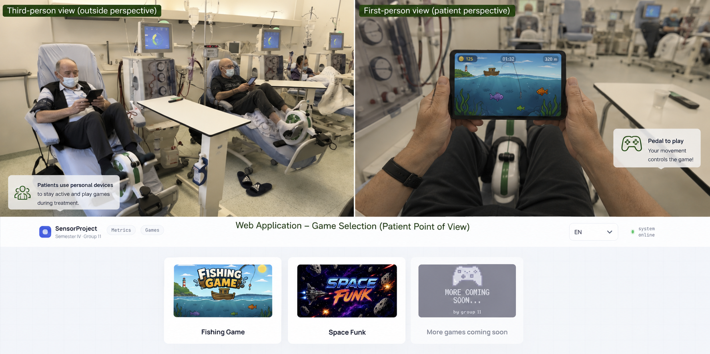

SENSOR INTEGRATED MOVEMENT DETECTION 
 
University of Southern Denmark
June 1st, 2026
Semester Project 4
Group 11
  

 

Everyone knows that diseases exist and many have been through exhausting situations with various illnesses and the medications that come with them. For some people though, the circumstances are even more strenuous, because what they have to go through, is a process called “hemodialysis”. 

Hemodialysis is a treatment for people whose kidneys aren’t working. In the possibility of a kidney failure, blood is not filtered the way it should. Dialysis does the work of the kidneys by removing waste products from the blood. If patients choose not to start immediately or even stop, kidney failure is imminent and survival may last from a few days to some weeks.

The problem about this treatment is that patients have to spend multiple days a week in hospitals, for a process that lasts three to five hours. For the dialysis to function better, patients may be encouraged or required to keep making some movements with their limbs, depending on ability. Unfortunately, during the operation, patients may be alone in the room, get exhausted and lose their motivation to carry on. Therefore, there is a need for a system that monitors patient movement and through gamified feedback, keeps the patients motivated to keep on being physically active during dialysis.

 That’s where the sensor integrated movement detection comes into play. The goal is to gamify the whole process by measuring patients’ performance (speed and cadence) on the devices using bicycle motion sensors connected to the web-application via Bluetooth Low Energy (BLE). These measurements will serve as information for lightweight games developed in Godot that convert boring and tiring cyclical movements into activities such as fishing or even hitting asteroids with a spaceship’s laser. The progress made in those games and the achievements earned by the patients will create a dopamine effect that will keep them motivated to persevere with being physically active. By viewing their metrics, players will be able to view the progress of their co-patients and increase the fun and engagement by mild competition, just like arcade games back in the day.

To install:

bleak  
fastapi  
uvicorn  
websockets  
sqlalchemy  
passlib[bcrypt]  
itsdangerous  
jinja2  

Pls run the app only using Docker:

>  docker-compose up --build